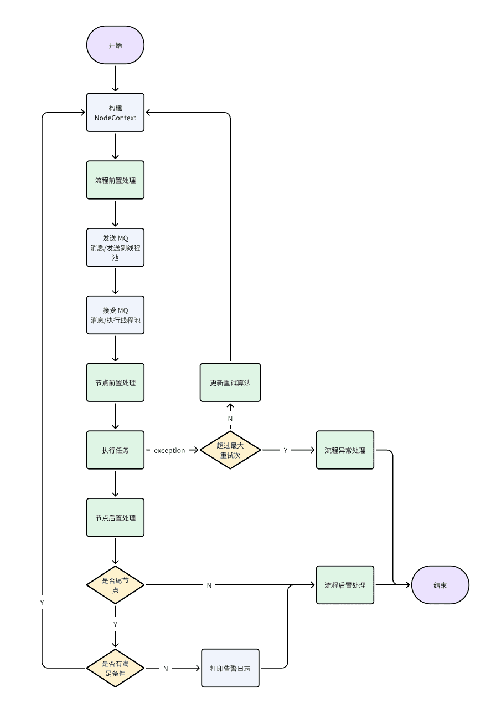

## 简介
该项目是基于 Springboot的简单流程编排代码实现，用户在进行简单代码和配置后即可实现流程编排
## 使用方法
```java
@Autowired
private FlowEngine flowEngine; //引入flowEngine

Map<String, Object> dataMap =new HashMap<>(); //需要全局保留的字段
flowEngine.execute("流程 ID",dataMap); //调用流程编排引擎
```
## 配置
```yaml
pay-flow:
  runner:
    create-exp: 线程池
  flow-handlers:
  - create-exp: 流程前置/后置处理，需要实现[NodeHandler.java]
  node-handlers:
    - create-exp: 节点前置/后置处理，需要实现[FlowHandler.java]
  flows:
    - id: 流程 ID
      nodes:
        - id: 节点 ID
          start: 是否开始节点
          end: 是否结束节点
          create-exp: 执行任务，需要实现[NodeAction.java]
          conditions:
            - when-nodes:
                - create-exp: 需要满足的条件，需要实现[ConditionAction.java]
                - simple-exp: 简单的 EL 表达式，返回值为 boolean
                - is-negated: true/false 取反
              to-nodes:
                - 下一个节点名称
          retry-times: 最大重试次数
          delay-level: 延迟级别
          execute-type: 执行方式，MQ 或 THREAD_POOL
          retry-algorithm-exp: 重试算法
```


## 主要流程图如下

其中绿色处皆可扩展